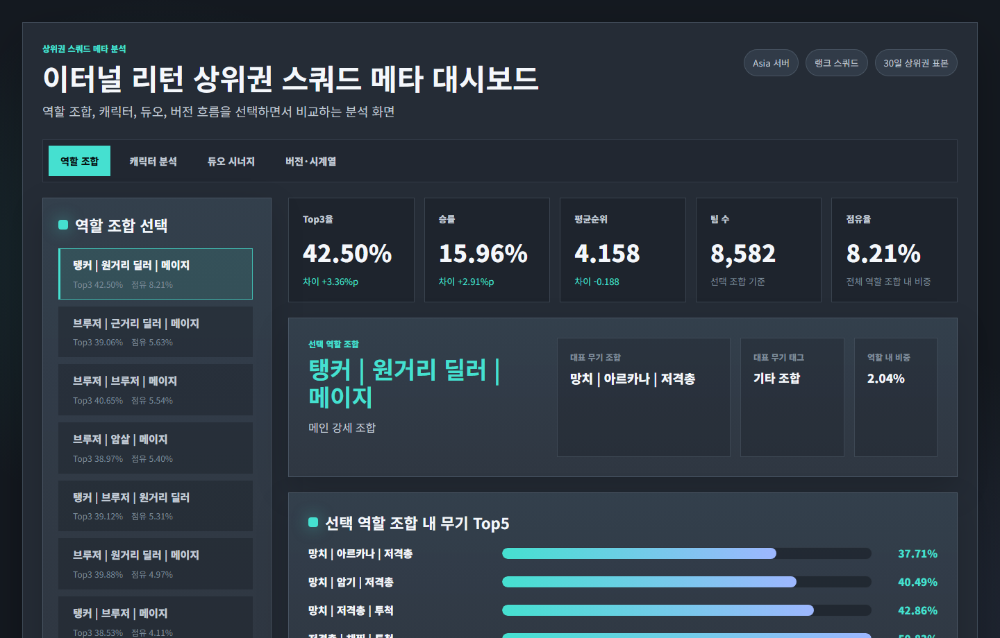
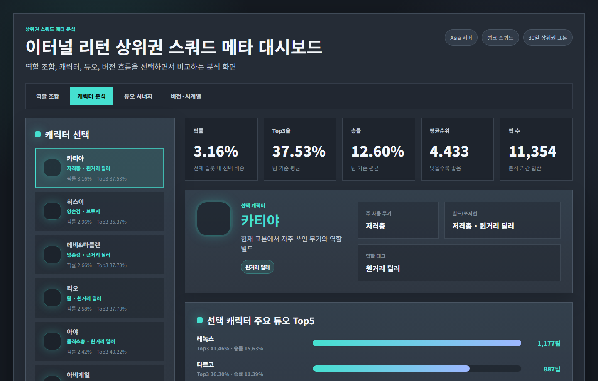
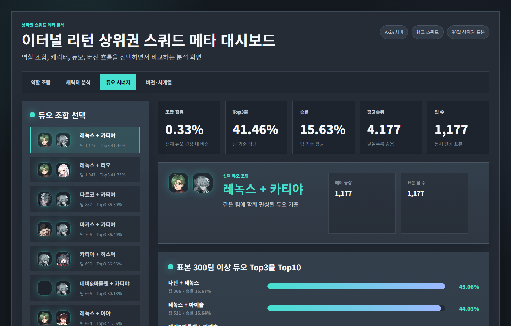
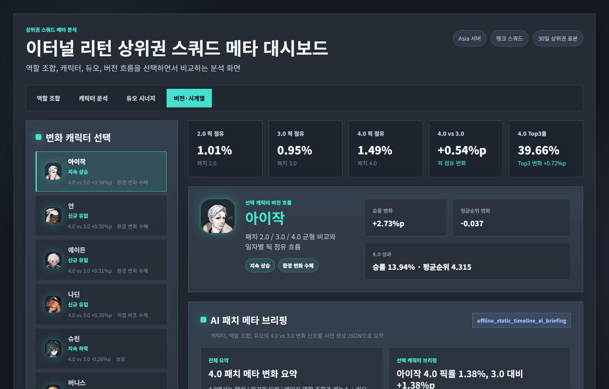
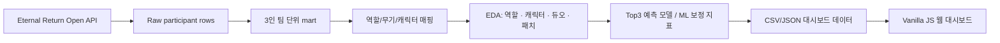

# Eternal Return Squad Meta Dashboard

아시아 랭크 스쿼드 상위권 데이터를 역할 조합, 캐릭터, 듀오 시너지, 패치 흐름 기준으로 탐색하는 웹 대시보드 프로젝트입니다.

단순 캐릭터 티어표가 아니라 3인 팀 구조와 패치 전후 변화를 함께 보면서, 어떤 조합이 안정적으로 Top3에 진입하는지 분석하는 데 초점을 맞췄습니다.

---

## 분석가 관점의 판단 과정

이 프로젝트에서 가장 먼저 정한 기준은 "좋은 캐릭터를 찾는 분석"이 아니라 "상위권 팀이 어떤 구조로 성과를 내는지 설명하는 분석"이었습니다. 이터널 리턴 스쿼드는 개인 캐릭터 성능만으로 결과가 결정되지 않고, 3인 역할 분담, 듀오 상성, 패치 버전, 표본 수가 함께 영향을 주기 때문입니다.

### 1. 왜 Top3를 성과 기준으로 잡았는가

배틀로얄 장르는 1등 여부만 보면 교전 타이밍, 최종 안전지대, 제3자 개입 같은 변동성이 크게 섞입니다. 그래서 우승 여부보다 안정적으로 상위권에 진입했는지를 보는 `Top3`를 핵심 성과 기준으로 잡았습니다. 이 기준을 사용하면 특정 조합이 한 번 크게 터진 사례보다, 반복적으로 상위권에 들어가는 조합을 더 잘 구분할 수 있습니다.

### 2. 데이터 신뢰도를 위해 먼저 버린 것

원천 API는 참가자 row 단위라 팀 성과와 바로 연결되지 않았습니다. 그래서 `gameId + teamNumber` 기준으로 3인 팀을 다시 묶고, 스쿼드 랭크가 아닌 표본이나 팀원이 3명으로 복원되지 않는 표본은 분석에서 제외했습니다. 캐릭터·무기 코드는 한글명과 역할 태그로 다시 매핑했고, 듀오 분석은 표본이 작은 조합이 과대평가되지 않도록 최소 표본 기준을 함께 표시했습니다.

### 3. Tableau를 포기하고 웹 대시보드로 전환한 이유

초기에는 Tableau로 시각화를 진행했지만, 캐릭터 아이콘 기반 탐색, 듀오 조합 검증 패널, 패치 버전별 브리핑 JSON, ML 보정 지표를 한 화면 안에서 연결하기에는 표현과 배포 방식이 제한적이었습니다. 그래서 "보고서용 차트"보다 "사용자가 직접 조합을 눌러보는 분석 도구"가 더 적합하다고 판단했고, 정적 CSV/JSON 기반 웹 대시보드로 전환했습니다.

### 4. 머신러닝을 어디까지 사용할지 정한 기준

모델은 조합을 자동으로 추천하기 위한 최종 판단자가 아니라, 사람이 본 조합 성과가 실제로 설명력을 갖는지 점검하는 보조 기준으로 사용했습니다. 구조 변수만 사용한 모델의 ROC-AUC가 약 `0.518` 수준에 머물렀기 때문에, 역할 조합만으로 성과를 단정하면 위험하다는 결론을 얻었습니다. 이후 교전 강도와 팀 성과 변수를 포함한 실전 검증 모델은 ROC-AUC `0.8755`까지 올랐지만, 이는 "조합 자체가 전부"라는 뜻이 아니라 "조합 해석에는 경기 맥락 보정이 필요하다"는 근거로 해석했습니다.

딥러닝은 적용하지 않았습니다. 현재 데이터는 스킬 사용 순서, 이동 경로, 교전 로그 같은 시계열 원천이 아니라 팀 단위 tabular 데이터에 가깝기 때문에, 딥러닝보다 LightGBM 계열 모델이 해석 가능성과 제출 재현성 면에서 더 적합하다고 판단했습니다.

### 5. 분석 결과를 실제로 어떻게 쓰는가

이 대시보드는 특정 패치 이후 픽률만 오른 조합과 실제 Top3 성과까지 오른 조합을 분리해 볼 수 있게 만들었습니다. 밸런스 패치 후 의도한 너프·버프가 성과 지표에 반영됐는지 확인하고, 특정 역할 조합이나 듀오가 과도하게 상위권을 점유하는지 모니터링하는 용도로 활용할 수 있습니다.

---

## 웹 대시보드 미리보기



### 구현 화면

| 역할 조합 분석 | 캐릭터 분석 |
| --- | --- |
|  |  |

| 듀오 시너지 | 버전·시계열 |
| --- | --- |
|  |  |

---

## 프로젝트 산출물

- 보고서(PDF)
  - [결과보고서_이터널리턴_상위권_스쿼드_메타_분석_최종본.pdf](output/portfolio/결과보고서_이터널리턴_상위권_스쿼드_메타_분석_최종본.pdf)
- 분석 노트북
  - `submissions/소스코드_1팀(이터널리턴_상위권_스쿼드_메타_분석).ipynb`
- 데이터 패키지
  - `submissions/데이터파일_1팀(이터널리턴_상위권_스쿼드_메타_분석).zip`
- 대시보드 코드
  - `web/`

---

## 주요 기능

### 역할 조합 분석

- 3인 스쿼드를 역할 조합 단위로 재구성
- 조합별 Top3 진입률, 승률, 평균 순위, 픽 수, 점유율 비교
- 동일 역할 조합 안에서 성과가 높은 무기 조합 Top5 제공
- LightGBM 기반 기대 성과와 실제 성과를 비교하는 ML 보정 패널 제공

### 캐릭터 분석

- 캐릭터별 픽률, Top3 진입률, 승률, 평균 순위 비교
- 캐릭터 아이콘과 역할 태그를 활용한 탐색 UI 구성
- 선택 캐릭터의 주요 듀오 파트너와 성과 지표 확인

### 듀오 시너지

- 캐릭터 2인 조합별 공동 등장 수와 성과 지표 계산
- 표본 수 기준을 함께 표시해 과소 표본 해석 위험 완화
- 표본 300팀 이상 듀오의 Top3 성과 순위 제공

### 버전·시계열

- 패치 버전별 픽률과 Top3 변화량 비교
- 캐릭터별 변화 유형과 주요 수치 요약
- 사전 생성된 AI 브리핑 JSON을 대시보드에 연결

---

## 분석 파이프라인



---

## 데이터 구성

- 데이터 출처: Eternal Return 공식 개발자 API
- 수집 범위
  - 서버: Asia
  - 모드: 스쿼드 랭크
  - 기간: 2026-02-15 ~ 2026-03-15
  - 원천 수집량: 667,560 participant rows
- 최종 분석 단위
  - `gameId + teamNumber` 기준 3인 팀 재구성
  - 최종 팀 표본: 119,823 teams

### 주요 mart

- `team_comp_structure_mart`: 팀 단위 역할 조합 성과
- `character_day_mart`: 캐릭터 일자별 픽률/성과
- `duo_synergy_mart`: 캐릭터 2인 조합 성과
- `patch_timeline`: 패치 버전별 변화량
- `ml_role_adjustment`: 모델 기대 성과 대비 실제 성과 차이

---

## 모델링

모델은 조합 추천 자체가 아니라, 팀 구조 정보가 Top3 성과를 어느 정도 설명하는지 검증하고 조합 성과를 보정하기 위한 보조 지표로 사용했습니다.

- 타깃: `is_top3`
- 구조 모델 해석: 역할 조합 중심 변수만으로는 ROC-AUC 약 `0.518` 수준이라, 조합만으로 성과를 단정하지 않음
- 누수 제거 변수
  - `gameRank`, `victory`, `teamKill`, `monsterKill`, `avg_mmrGain`, `avg_mmrAfter`
- 비교 모델
  - Dummy baseline
  - Logistic Regression
  - Extra Trees
  - LightGBM
- 최종 실전 검증 모델
  - ROC-AUC: `0.8755`
  - Average Precision: `0.8291`
  - Top Decile Lift: `2.52`

---

## 활용 관점

- 밸런스 패치 이후 픽률 상승과 실제 성과 상승을 분리해 패치 효과를 검증
- 단일 캐릭터가 아니라 역할 조합과 듀오 관계까지 포함한 상위권 메타 해석
- 현재 패치에서 안정적인 조합 후보와 밴픽 전략을 탐색하는 참고 자료로 활용
- 특정 조합의 과도한 성과, 메타 편중, 패치 영향 여부를 빠르게 모니터링

---

## 사용 기술

- Data Collection: Python, Requests, Eternal Return Open API
- Data Analysis: Pandas, NumPy
- Modeling: Scikit-learn, LightGBM, Extra Trees, Logistic Regression
- Visualization: Vanilla JavaScript, HTML5, CSS3
- Dashboard Data: Static CSV/JSON
- Deployment: Docker, Railway

---

## 실행 방법

프로젝트 루트에서 실행합니다. `web/src` 폴더 안에서 실행하면 상대 경로가 맞지 않습니다.

```powershell
py -3 -m http.server 8787 --directory web
```

접속:

```text
http://localhost:8787/
```

`py -3`가 동작하지 않는 환경에서는 아래처럼 실행합니다.

```bash
python3 -m http.server 8787 --directory web
```

### Docker 실행

```bash
docker build -t eternal-return-squad-meta-dashboard .
docker run -p 8080:8080 eternal-return-squad-meta-dashboard
```

접속:

```text
http://localhost:8080/
```

> 주의: 위 대시보드는 정적 CSV/JSON 데이터 기준이며, API 재수집 또는 데이터 버전 변경 시 결과 수치가 달라질 수 있습니다.
