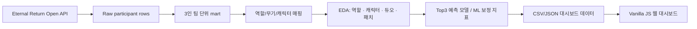

# Eternal Return Squad Meta Dashboard

아시아 랭크 스쿼드 상위권 데이터를 역할 조합, 캐릭터, 듀오 시너지, 패치 흐름 기준으로 탐색하는 웹 대시보드 프로젝트입니다.

단순 캐릭터 티어표가 아니라 3인 팀 구조와 패치 전후 변화를 함께 보면서, 어떤 조합이 안정적으로 Top3에 진입하는지 분석하는 데 초점을 맞췄습니다.

---

## 분석가 관점의 판단 과정

처음에는 캐릭터별 성과를 정리하는 방식도 생각했습니다. 하지만 스쿼드 데이터를 보다 보니, 상위권 성과는 캐릭터 하나보다 3명이 어떤 역할로 묶였는지, 어떤 듀오가 같이 쓰였는지, 그리고 패치 이후 흐름이 어떻게 바뀌었는지가 더 크게 보였습니다. 그래서 방향을 "캐릭터 티어표"가 아니라 "팀 구조를 설명하는 분석"으로 잡았습니다.

### 1. 성과 기준을 Top3로 둔 이유

Top3를 잡은 이유는 단순히 "상위권"이라는 감각 때문만은 아닙니다. 이터널 리턴 랭크 포인트(RP) 구조를 보면 생존 순위 보상이 1위 40점, 2위 25점, 3위 20점, 4위 10점으로 떨어집니다. 3위와 4위 사이에서 생존 RP가 절반으로 줄기 때문에, 3위 안에 드는 것은 게임 시스템상으로도 의미 있는 성과 구간입니다.

물론 1등만 보면 더 강한 기준처럼 보일 수 있습니다. 다만 배틀로얄에서는 마지막 안전지대 위치, 교전 타이밍, 제3자 개입처럼 한 경기 안의 변동성이 큽니다. 그래서 이 프로젝트에서는 "한 번 우승한 조합"보다 "RP를 안정적으로 벌 수 있는 상위권 조합"을 보고 싶었고, 그 기준을 Top3로 잡았습니다.

### 2. 그대로 쓰지 않은 데이터

원천 API는 참가자 한 명씩 row가 나오는 구조라서, 그대로는 팀 성과를 볼 수 없었습니다. 먼저 `gameId + teamNumber`로 3인 팀을 다시 만들었고, 스쿼드 랭크가 아니거나 3인 팀으로 복원되지 않는 표본은 제외했습니다. 캐릭터와 무기 코드는 한글명과 역할 태그로 다시 매핑했습니다. 듀오 분석에서는 표본이 작은 조합이 과하게 좋아 보일 수 있어서, 최소 표본 기준을 같이 보여주도록 했습니다.

### 3. Tableau를 포기하고 웹 대시보드로 전환한 이유

처음에는 Tableau로 끝낼 생각이었습니다. 그런데 작업을 진행할수록 캐릭터 아이콘, 듀오 검증 패널, 패치별 브리핑, ML 보정 지표를 한 화면에서 자연스럽게 연결해야 했습니다. Tableau에서는 보여줄 수는 있어도, 제가 원하는 방식으로 눌러보고 비교하는 경험을 만들기 어려웠습니다. 그래서 보고서용 차트보다 직접 탐색하는 웹 대시보드가 맞다고 보고 방향을 바꿨습니다.

### 4. 모델링을 검증 도구로 제한한 이유

모델을 조합 추천의 정답처럼 쓰고 싶지는 않았습니다. 오히려 제가 만든 조합 지표가 성과를 얼마나 설명하는지 확인하는 보조 도구로 두었습니다. 역할 조합 중심 변수만 넣었을 때 ROC-AUC가 약 `0.518`에 머물렀고, 이 결과를 보고 "역할 조합만으로 성과를 단정하면 안 된다"는 쪽으로 해석했습니다. 이후 교전 강도와 팀 성과 변수를 포함한 모델은 ROC-AUC `0.8755`까지 올라갔지만, 이 역시 조합이 전부라는 뜻이 아니라 경기 맥락을 함께 봐야 한다는 근거로 사용했습니다.

복잡한 모델을 먼저 붙이는 방향은 의도적으로 제외했습니다. 이번 데이터는 이동 좌표, 스킬 사용 순서, 교전 타임라인처럼 시간 흐름이 살아 있는 로그가 아니라 경기 종료 후 집계된 팀 단위 tabular 데이터에 가까웠습니다. 이런 구조에서는 모델을 복잡하게 만드는 것보다, Logistic Regression, Extra Trees, LightGBM처럼 비교와 재현이 쉬운 모델로 조합 지표가 성과를 얼마나 설명하는지 검증하는 편이 더 맞다고 판단했습니다.

### 4-1. RP와 MMR 변수를 따로 본 이유

`rankPoint`는 플레이어의 랭크 티어를 움직이는 점수입니다. 경기 결과에 따라 생존 순위 점수, 처치·어시스트 점수, 티어별 입장료 등이 반영되어 오르거나 내려갑니다. 쉽게 말하면 "이 플레이어가 현재 랭크에서 어느 정도 위치에 있는지"를 보여주는 점수입니다.

MMR은 일반적으로 매치메이킹 레이팅, 즉 플레이어의 실력대와 매칭 강도를 나타내는 점수입니다. API에는 `mmrBefore`, `mmrGain`, `mmrAfter` 같은 MMR 계열 필드가 함께 들어옵니다. 이 프로젝트에서는 `mmrBefore`와 `avg_rankPoint`를 경기 전 실력대 보정 변수로 봤고, `mmrGain`, `mmrAfter`처럼 경기 후 결과가 반영된 값은 구조 모델에서는 제외했습니다. 조합이 좋아서 Top3에 간 것인지, 애초에 강한 유저들이 잡은 조합이라 성과가 좋아 보이는 것인지 분리해서 보기 위해서입니다.

### 5. 분석 결과를 실제로 어떻게 쓰는가

이 대시보드는 패치 이후 픽률만 오른 조합과 실제 Top3 성과까지 오른 조합을 나눠서 볼 수 있습니다. 밸런스 패치가 의도대로 작동했는지 확인하거나, 특정 역할 조합과 듀오가 상위권을 과하게 점유하는지 보는 모니터링 도구로 활용할 수 있습니다.

---

## 웹 대시보드 미리보기


### 구현 화면

| 역할 조합 분석 | 캐릭터 분석 |
| --- | --- |
|  |  |

| 듀오 시너지 | 버전·시계열 |
| --- | --- |
|  |  |

---

## 프로젝트 산출물

- 보고서(PDF)
  - [결과보고서_이터널리턴_상위권_스쿼드_메타_분석_최종본.pdf](output/portfolio/결과보고서_이터널리턴_상위권_스쿼드_메타_분석_최종본.pdf)
- 분석 노트북
  - `submissions/소스코드_1팀(이터널리턴_상위권_스쿼드_메타_분석).ipynb`
- 데이터 패키지
  - `submissions/데이터파일_1팀(이터널리턴_상위권_스쿼드_메타_분석).zip`
- 대시보드 코드
  - `web/`

---

## 주요 기능

### 역할 조합 분석

- 3인 스쿼드를 역할 조합 단위로 재구성
- 조합별 Top3 진입률, 승률, 평균 순위, 픽 수, 점유율 비교
- 동일 역할 조합 안에서 성과가 높은 무기 조합 Top5 제공
- LightGBM 기반 기대 성과와 실제 성과를 비교하는 ML 보정 패널 제공

### 캐릭터 분석

- 캐릭터별 픽률, Top3 진입률, 승률, 평균 순위 비교
- 캐릭터 아이콘과 역할 태그를 활용한 탐색 UI 구성
- 선택 캐릭터의 주요 듀오 파트너와 성과 지표 확인

### 듀오 시너지

- 캐릭터 2인 조합별 공동 등장 수와 성과 지표 계산
- 표본 수 기준을 함께 표시해 과소 표본 해석 위험 완화
- 표본 300팀 이상 듀오의 Top3 성과 순위 제공

### 버전·시계열

- 패치 버전별 픽률과 Top3 변화량 비교
- 캐릭터별 변화 유형과 주요 수치 요약
- 사전 생성된 AI 브리핑 JSON을 대시보드에 연결

---

## 분석 파이프라인



---

## 데이터 구성

- 데이터 출처: Eternal Return 공식 개발자 API
- 수집 범위
  - 서버: Asia
  - 모드: 스쿼드 랭크
  - 기간: 2026-02-15 ~ 2026-03-15
  - 원천 수집량: 667,560 participant rows
- 최종 분석 단위
  - `gameId + teamNumber` 기준 3인 팀 재구성
  - 최종 팀 표본: 119,823 teams

### 주요 mart

- `team_comp_structure_mart`: 팀 단위 역할 조합 성과
- `character_day_mart`: 캐릭터 일자별 픽률/성과
- `duo_synergy_mart`: 캐릭터 2인 조합 성과
- `patch_timeline`: 패치 버전별 변화량
- `ml_role_adjustment`: 모델 기대 성과 대비 실제 성과 차이

---

## 모델링

모델은 조합 추천 자체가 아니라, 팀 구조 정보가 Top3 성과를 어느 정도 설명하는지 검증하고 조합 성과를 보정하기 위한 보조 지표로 사용했습니다.

- 타깃: `is_top3`
- 구조 모델 해석: 역할 조합 중심 변수만으로는 ROC-AUC 약 `0.518` 수준이라, 조합만으로 성과를 단정하지 않음
- 실력 보정 변수 해석
  - `avg_rankPoint`: 팀원의 평균 랭크 포인트. 경기 전 실력대와 티어 수준을 보는 변수
  - `avg_mmrBefore`: 경기 시작 전 평균 MMR/RP 계열 값. 조합을 잡은 유저들의 사전 실력 차이를 보정하기 위한 변수
  - `avg_mmrGain`, `avg_mmrAfter`: 경기 후 결과가 반영된 값이라 구조 모델에서는 제외
- 누수 제거 변수
  - `gameRank`, `victory`, `teamKill`, `monsterKill`, `avg_mmrGain`, `avg_mmrAfter`
- 비교 모델
  - Dummy baseline
  - Logistic Regression
  - Extra Trees
  - LightGBM
- 최종 실전 검증 모델
  - ROC-AUC: `0.8755`
  - Average Precision: `0.8291`
  - Top Decile Lift: `2.52`

---

## 활용 관점

- 밸런스 패치 이후 픽률 상승과 실제 성과 상승을 분리해 패치 효과를 검증
- 단일 캐릭터가 아니라 역할 조합과 듀오 관계까지 포함한 상위권 메타 해석
- 현재 패치에서 안정적인 조합 후보와 밴픽 전략을 탐색하는 참고 자료로 활용
- 특정 조합의 과도한 성과, 메타 편중, 패치 영향 여부를 빠르게 모니터링

---

## 사용 기술

- Data Collection: Python, Requests, Eternal Return Open API
- Data Analysis: Pandas, NumPy
- Modeling: Scikit-learn, LightGBM, Extra Trees, Logistic Regression
- Visualization: Vanilla JavaScript, HTML5, CSS3
- Dashboard Data: Static CSV/JSON
- Deployment: Docker, Railway

---

## 실행 방법

프로젝트 루트에서 실행합니다. `web/src` 폴더 안에서 실행하면 상대 경로가 맞지 않습니다.

```powershell
py -3 -m http.server 8787 --directory web
```

접속:

```text
http://localhost:8787/
```

`py -3`가 동작하지 않는 환경에서는 아래처럼 실행합니다.

```bash
python3 -m http.server 8787 --directory web
```

### Docker 실행

```bash
docker build -t eternal-return-squad-meta-dashboard .
docker run -p 8080:8080 eternal-return-squad-meta-dashboard
```

접속:

```text
http://localhost:8080/
```

> 주의: 위 대시보드는 정적 CSV/JSON 데이터 기준이며, API 재수집 또는 데이터 버전 변경 시 결과 수치가 달라질 수 있습니다.
