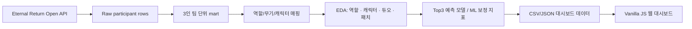

# Eternal Return Squad Meta Dashboard

아시아 랭크 스쿼드 상위권 데이터를 역할 조합, 캐릭터, 듀오 시너지, 패치 흐름 기준으로 탐색하는 웹 대시보드 프로젝트입니다.

단순 캐릭터 티어표가 아니라 3인 팀 구조와 패치 전후 변화를 함께 보면서, 어떤 조합이 안정적으로 Top3에 진입하는지 분석하는 데 초점을 맞췄습니다.

---

## 웹 대시보드 미리보기


### 구현 화면

| 역할 조합 분석 | 캐릭터 분석 |
| --- | --- |
|  |  |

| 듀오 시너지 | 버전·시계열 |
| --- | --- |
|  |  |

---

## 프로젝트 산출물

- 보고서(PDF)
  - [결과보고서_이터널리턴_상위권_스쿼드_메타_분석_최종본.pdf](output/portfolio/결과보고서_이터널리턴_상위권_스쿼드_메타_분석_최종본.pdf)
- 분석 노트북
  - `submissions/소스코드_1팀(이터널리턴_상위권_스쿼드_메타_분석).ipynb`
- 데이터 패키지
  - `submissions/데이터파일_1팀(이터널리턴_상위권_스쿼드_메타_분석).zip`
- 대시보드 코드
  - `web/`

---

## 주요 기능

### 역할 조합 분석

- 3인 스쿼드를 역할 조합 단위로 재구성
- 조합별 Top3 진입률, 승률, 평균 순위, 픽 수, 점유율 비교
- 동일 역할 조합 안에서 성과가 높은 무기 조합 Top5 제공
- LightGBM 기반 기대 성과와 실제 성과를 비교하는 ML 보정 패널 제공

### 캐릭터 분석

- 캐릭터별 픽률, Top3 진입률, 승률, 평균 순위 비교
- 캐릭터 아이콘과 역할 태그를 활용한 탐색 UI 구성
- 선택 캐릭터의 주요 듀오 파트너와 성과 지표 확인

### 듀오 시너지

- 캐릭터 2인 조합별 공동 등장 수와 성과 지표 계산
- 표본 수 기준을 함께 표시해 과소 표본 해석 위험 완화
- 표본 300팀 이상 듀오의 Top3 성과 순위 제공

### 버전·시계열

- 패치 버전별 픽률과 Top3 변화량 비교
- 캐릭터별 변화 유형과 주요 수치 요약
- 사전 생성된 AI 브리핑 JSON을 대시보드에 연결

---

## 분석 파이프라인



---

## 데이터 구성

- 데이터 출처: Eternal Return 공식 개발자 API
- 수집 범위
  - 서버: Asia
  - 모드: 스쿼드 랭크
  - 기간: 2026-02-15 ~ 2026-03-15
  - 원천 수집량: 667,560 participant rows
- 최종 분석 단위
  - `gameId + teamNumber` 기준 3인 팀 재구성
  - 최종 팀 표본: 119,823 teams

### 주요 mart

- `team_comp_structure_mart`: 팀 단위 역할 조합 성과
- `character_day_mart`: 캐릭터 일자별 픽률/성과
- `duo_synergy_mart`: 캐릭터 2인 조합 성과
- `patch_timeline`: 패치 버전별 변화량
- `ml_role_adjustment`: 모델 기대 성과 대비 실제 성과 차이

---

## 모델링

모델은 조합 추천 자체가 아니라, 팀 구조 정보가 Top3 성과를 어느 정도 설명하는지 검증하고 조합 성과를 보정하기 위한 보조 지표로 사용했습니다.

- 타깃: `is_top3`
- 누수 제거 변수
  - `gameRank`, `victory`, `teamKill`, `monsterKill`, `avg_mmrGain`, `avg_mmrAfter`
- 비교 모델
  - Dummy baseline
  - Logistic Regression
  - Extra Trees
  - LightGBM
- 최종 실전 검증 모델
  - ROC-AUC: `0.8755`
  - Average Precision: `0.8291`
  - Top Decile Lift: `2.52`

---

## 활용 관점

- 밸런스 패치 이후 픽률 상승과 실제 성과 상승을 분리해 패치 효과를 검증
- 단일 캐릭터가 아니라 역할 조합과 듀오 관계까지 포함한 상위권 메타 해석
- 현재 패치에서 안정적인 조합 후보와 밴픽 전략을 탐색하는 참고 자료로 활용
- 특정 조합의 과도한 성과, 메타 편중, 패치 영향 여부를 빠르게 모니터링

---

## 사용 기술

- Data Collection: Python, Requests, Eternal Return Open API
- Data Analysis: Pandas, NumPy
- Modeling: Scikit-learn, LightGBM, Extra Trees, Logistic Regression
- Visualization: Vanilla JavaScript, HTML5, CSS3
- Dashboard Data: Static CSV/JSON
- Deployment: Docker, Railway

---

## 실행 방법

프로젝트 루트에서 실행합니다. `web/src` 폴더 안에서 실행하면 상대 경로가 맞지 않습니다.

```powershell
py -3 -m http.server 8787 --directory web
```

접속:

```text
http://localhost:8787/
```

`py -3`가 동작하지 않는 환경에서는 아래처럼 실행합니다.

```bash
python3 -m http.server 8787 --directory web
```

### Docker 실행

```bash
docker build -t eternal-return-squad-meta-dashboard .
docker run -p 8080:8080 eternal-return-squad-meta-dashboard
```

접속:

```text
http://localhost:8080/
```

> 주의: 위 대시보드는 정적 CSV/JSON 데이터 기준이며, API 재수집 또는 데이터 버전 변경 시 결과 수치가 달라질 수 있습니다.
