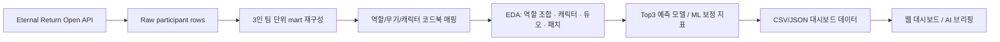

# Eternal Return 상위권 스쿼드 메타 분석 대시보드

## Eternal Return 아시아 랭크 스쿼드 데이터 기반 Top3 성과 분석

## 요약 파트

### 1. 프로젝트 개요

프로젝트 일정/인원

- 2026.04 / 1팀 최종 프로젝트
- 주제: 이터널 리턴 상위권 스쿼드 메타 분석 및 웹 대시보드 구현

문제 정의

- 일반적인 캐릭터 티어 중심 분석은 스쿼드 게임의 실제 성과 구조를 충분히 설명하기 어렵다.
- 상위권 스쿼드 성과는 단일 캐릭터보다 역할 조합, 듀오 시너지, 패치 버전 변화가 함께 작동하는 문제다.
- 밸런스 패치 이후 픽률과 Top3 진입률이 의도한 방향으로 움직였는지 확인할 수 있는 탐색 도구가 필요하다.

수행 역할

- Eternal Return 공식 API 기반 아시아 서버 상위권 스쿼드 데이터 수집
- 참가자 row 데이터를 `gameId + teamNumber` 기준 3인 팀 단위 mart로 재구성
- 캐릭터/무기 코드북과 역할 태그 매핑 설계
- 역할 조합, 캐릭터, 듀오 시너지, 패치 흐름 EDA 수행
- LightGBM 기반 Top3 예측 모델과 ML 보정 지표 생성
- Vanilla JS 기반 웹 대시보드 및 Railway 배포 구조 구현

### 2. 결과 및 직무에 적용할 점

- 119,823개 팀 표본을 기준으로 역할 조합별 Top3 진입률, 승률, 평균 순위를 비교할 수 있다.
- 캐릭터 단독 지표가 아니라 조합 구조와 듀오 관계를 함께 보며 상위권 메타를 해석할 수 있다.
- 패치 버전별 픽률/성과 변화를 통해 밸런스 패치가 실제 상위권 성과에 미친 영향을 검증할 수 있다.
- ML 보정 지표로 플레이어 실력 효과가 섞인 조합 성과를 기대 성과 대비 초과/부족 관점에서 해석할 수 있다.
- 정적 CSV/JSON 기반 대시보드로 구현해 API 키나 DB 없이 안정적으로 배포 가능한 분석 산출물을 만들었다.

### 3. 주요 액션: 분석 파이프라인

## 상세 파트

### 1. 데이터 수집

- 데이터 출처: Eternal Return 공식 개발자 API
- 수집 범위
  - 서버: Asia
  - 모드: 스쿼드 랭크
  - 기간: 2026-02-15 ~ 2026-03-15
  - 원천 수집량: 667,560 participant rows
- 최종 분석 단위
  - `gameId + teamNumber` 기준 3인 팀 재구성
  - 최종 팀 표본: 119,823 teams

### 2. 데이터 전처리

- 참가자 단위 데이터를 팀 단위로 변환
  - 팀원 3명 필터링
  - 캐릭터, 전술 스킬, 특성, 무기 정보를 슬롯별로 pivot
  - Top3 여부(`is_top3`)와 승리 여부(`is_win`) 생성
- 캐릭터/무기 역할 매핑
  - 무기 기반 역할 태그를 `탱커`, `브루저`, `근거리 딜러`, `원거리 딜러`, `메이지`, `암살`, `유틸`로 정리
  - 캐릭터-무기 조합 단위로 기본 역할과 보조 역할을 검수
- 대시보드용 mart 분리
  - 역할 조합 story feed
  - 캐릭터 일별 성과 mart
  - 듀오 시너지 mart
  - 패치 버전 비교 mart

### 3. EDA

분석 질문

- 어떤 3인 역할 조합이 안정적으로 Top3를 만드는가
- 특정 캐릭터의 성과는 픽률 증가와 함께 움직이는가
- 캐릭터 두 명의 듀오 조합이 전체 팀 성과에 의미 있는 차이를 만드는가
- 패치 이후 메타 변화가 특정 캐릭터/조합에 유리하게 작동했는가

핵심 분석 축

- 역할 조합 분석
  - 조합별 표본 수, Top3 진입률, 승률, 평균 순위 비교
  - 동일 역할 조합 안에서 무기 조합 Top5 drilldown 제공
- 캐릭터 분석
  - 날짜/버전별 픽률, Top3 진입률, 승률, 평균 순위 비교
  - 캐릭터 아이콘을 활용해 대시보드 탐색성을 개선
- 듀오 시너지 분석
  - 캐릭터 쌍의 공동 등장 수와 성과 지표 계산
  - 표본 수 기준을 함께 표시해 과소 표본 해석 위험을 줄임
- 패치 타임라인 분석
  - 2.0, 3.0, 4.0 버전 간 픽률/Top3 변화량 비교
  - 지속 상승, 지속 하락, 정체·하락 등 변화 유형 라벨링

### 4. 모델링

모델링 목적

- 모델 자체가 최종 목적이 아니라, 팀 구조 정보가 Top3 성과를 어느 정도 설명하는지 검증하는 보조 장치로 활용
- 조합 성과에서 플레이어 실력 효과를 일부 보정하기 위한 기대 성과 기준 생성

실험 설계

- 타깃: `is_top3`
- 누수 제거
  - `gameRank`, `victory`, `teamKill`, `monsterKill`, `avg_mmrGain`, `avg_mmrAfter` 등 경기 종료 후 결과성 변수 제외
- 주요 모델
  - Dummy baseline
  - Logistic Regression
  - Extra Trees
  - LightGBM

주요 성능

- 패치 홀드아웃 검증: `2.0 + 3.0` 학습, `4.0` 테스트
- 최종 실전 검증 모델: `lightgbm_strength_practical`
  - ROC-AUC: `0.8755`
  - Average Precision: `0.8291`
  - Top Decile Lift: `2.52`
- Random holdout 기준 최고 모델
  - ROC-AUC: `0.9457`
  - Accuracy: `0.8761`

활용 방식

- 역할 조합별 실제 Top3 진입률과 모델 기대 Top3 진입률을 비교
- 기대값보다 높은 조합은 표본과 플레이어 강도를 감안해도 성과가 좋은 구조로 해석
- 기대값보다 낮은 조합은 픽률 대비 성과가 낮은 후보로 분류

### 5. 웹 대시보드

대시보드 화면

- 역할 조합
  - 역할 조합별 KPI
  - 무기 조합 Top5
  - ML 보정 조합 성과
  - 역할 조합 × 듀오 검증 패널
- 캐릭터 분석
  - 캐릭터별 픽률/Top3/승률/평균 순위
  - 캐릭터 아이콘 기반 탐색
- 듀오 시너지
  - 캐릭터 쌍별 표본 수와 성과 지표
  - 표본 신뢰도 라벨
- 버전·시계열
  - 패치별 메타 변화
  - 캐릭터 변화 유형과 AI 브리핑

데이터 제공 방식

- 서버 DB 없이 `web/src/data`의 정적 CSV/JSON 파일을 로드
- API 키를 배포 환경에 노출하지 않음
- Railway에서는 Dockerfile 기반 정적 파일 서버로 배포

### 6. 결과 및 기대효과

기대효과

- 밸런스 패치 이후 픽률 상승과 실제 성과 상승을 분리해 패치 효과를 검증할 수 있다.
- 상위권 메타에서 강한 조합이 단일 캐릭터 때문인지, 역할 구조나 듀오 관계 때문인지 탐색할 수 있다.
- 유저나 e스포츠 코치는 현재 패치에서 안정적인 조합 후보와 밴픽 전략을 세우는 참고 자료로 활용할 수 있다.
- 운영/기획 관점에서는 특정 조합의 과도한 성과, 패치 영향, 메타 편중 현상을 빠르게 모니터링할 수 있다.

한계

- 전체 유저 전수 데이터가 아니라 상위권 snowball 수집 표본이므로 전체 유저군 대표성에는 한계가 있다.
- 패치별 표본 크기가 다르기 때문에 절대값보다 방향성 중심 해석이 필요하다.
- 실시간 API 동기화가 아니라 정적 데이터 기반 대시보드이므로 최신화에는 재수집/재배포가 필요하다.

개선 방향

- GitHub Actions 또는 Railway cron 기반 정기 데이터 업데이트
- SHAP 기반 모델 설명값을 대시보드에 직접 연결
- 패치 노트 텍스트와 성과 변화량을 결합한 자동 패치 리포트 생성
- 실시간 밴픽 추천보다는 패치별 조합 후보 탐색 도구로 고도화

---

### 사용 기술 스택

- Data Collection: Python, Requests, Eternal Return Open API
- Data Analysis: Pandas, NumPy
- Modeling: Scikit-learn, LightGBM, Extra Trees, Logistic Regression
- Visualization: Vanilla JavaScript, HTML5, CSS3
- Dashboard Data: Static CSV/JSON
- Deployment: Docker, Railway

### 프로젝트 파일 및 실행법

- 보고서(PDF)
  - [결과보고서_이터널리턴_상위권_스쿼드_메타_분석_최종본.pdf](output/portfolio/결과보고서_이터널리턴_상위권_스쿼드_메타_분석_최종본.pdf)
- 분석 노트북
  - `submissions/소스코드_1팀(이터널리턴_상위권_스쿼드_메타_분석).ipynb`
- 데이터 패키지
  - `submissions/데이터파일_1팀(이터널리턴_상위권_스쿼드_메타_분석).zip`
- 대시보드 코드 및 실행
  - `web/`
  - 실행: `py -3 -m http.server 8787 --directory web`
  - 접속: `http://localhost:8787/`
- Docker 실행
  - `docker build -t eternal-return-squad-meta-dashboard .`
  - `docker run -p 8080:8080 eternal-return-squad-meta-dashboard`
  - 접속: `http://localhost:8080/`

> 주의: 위 대시보드는 정적 CSV/JSON 데이터 기준이며, API 재수집 또는 데이터 버전 변경 시 결과 수치가 달라질 수 있다.
