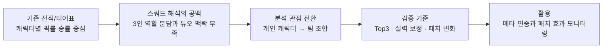
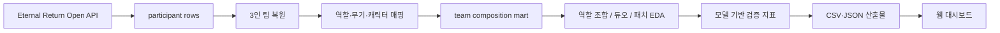

# Eternal Return Squad Meta Dashboard

> 상위권 스쿼드 메타를 캐릭터 티어가 아니라 **팀 조합, 듀오 시너지, 패치 변화** 관점에서 다시 해석한 웹 대시보드 프로젝트

## 이 프로젝트가 답하려 한 질문

전적 사이트나 티어표는 특정 캐릭터가 얼마나 많이 쓰이고 승률이 어떤지 빠르게 보여줍니다. 하지만 이터널 리턴의 스쿼드 랭크는 캐릭터 하나의 성능만으로 설명하기 어렵습니다. 같은 캐릭터라도 어떤 역할 조합에 들어갔는지, 누구와 듀오로 묶였는지, 패치 이후에도 성과가 유지되는지에 따라 의미가 달라집니다.

그래서 이 프로젝트는 “좋은 캐릭터가 무엇인가”보다 **상위권에서 안정적으로 성과를 내는 팀 구조는 무엇인가**를 질문으로 잡았습니다.

| 핵심 관점 | 정리 |
| --- | --- |
| 분석 대상 | Asia 서버 스쿼드 랭크 119,823팀 |
| 성과 기준 | RP 보상 구조를 반영한 `Top3` 진입 |
| 주요 지표 | 역할 조합, 캐릭터 성과, 듀오 시너지, 패치별 변화량 |
| 검증 방식 | 팀 구조 단독 모델과 실전 검증 모델을 분리해 조합 지표의 설명력 확인 |
| 산출물 | 4개 탭 웹 대시보드, 제출 노트북, 결과보고서, 정적 CSV/JSON 데이터 |

## 문제 정의



## 기획과 판단 기준

처음에는 캐릭터별 성과표만 만들어도 충분하다고 생각했습니다. 하지만 데이터를 팀 단위로 복원해보니, 상위권 성과는 캐릭터 하나보다 `3명이 어떤 역할로 묶였는지`, `반복적으로 함께 쓰이는 듀오가 있는지`, `패치 이후에도 그 조합이 유지되는지`가 더 중요했습니다. 그래서 참가자 row를 그대로 집계하지 않고 `gameId + teamNumber` 기준의 3인 팀 mart를 먼저 만들었습니다.

성과 기준도 단순 우승이 아니라 `Top3`로 잡았습니다. 랭크 포인트 구조상 생존 순위 보상은 1위 40점, 2위 25점, 3위 20점, 4위 10점으로 떨어집니다. 3위와 4위 사이에서 보상이 크게 갈리기 때문에, Top3는 “한 번 우승한 조합”보다 “랭크에서 안정적으로 점수를 벌 수 있는 조합”을 보는 기준으로 더 적합하다고 판단했습니다.

## 분석 설계의 핵심

| 판단 지점 | 선택한 기준 | 이유 |
| --- | --- | --- |
| 팀 단위 재구성 | `gameId + teamNumber` 기준 3인 팀 복원 | 원천 API는 참가자 row라 그대로는 팀 성과를 설명하기 어려움 |
| 성과 기준 | Top3 진입 여부 | 배틀로얄 변동성을 줄이고 랭크 점수 관점의 안정 성과를 보기 위함 |
| 실력 보정 | `avg_rankPoint`, `avg_mmrBefore` 확인 | 강한 유저가 잡은 조합인지, 조합 자체의 성과인지 분리하기 위함 |
| 누수 제거 | `victory`, `gameRank`, `avg_mmrGain`, `avg_mmrAfter` 제외 | 경기 후 결과가 모델에 섞이는 문제 방지 |
| 모델링 범위 | Logistic Regression, Extra Trees, LightGBM 비교 | 집계형 tabular 데이터에서 해석과 재현이 쉬운 검증 모델이 적합 |

## 모델링을 사용한 이유

모델은 조합 추천 정답을 만들기 위한 장치가 아니라, **내가 만든 조합 지표가 성과를 얼마나 설명하는지 확인하는 검증 도구**로 사용했습니다. 역할 조합 중심 변수만 넣은 구조 모델은 ROC-AUC가 약 `0.518`에 머물렀습니다. 이 결과는 실패라기보다 “역할 조합만으로 성과를 단정하면 안 된다”는 근거가 됐습니다.

반대로 교전 강도와 팀 성과 변수를 포함한 실전 검증 모델은 ROC-AUC `0.8755`까지 올라갔습니다. 여기서 얻은 결론은 조합이 전부라는 뜻이 아니라, 실제 성과 해석에는 조합과 함께 실력대, 교전 강도, 패치 맥락을 같이 봐야 한다는 점입니다.

## 데이터 흐름



## 차별점

| 기존 방식의 한계 | 이 프로젝트의 관점 |
| --- | --- |
| 캐릭터 단위 픽률과 승률은 빠르게 볼 수 있지만, 스쿼드 역할 분담을 설명하기 어려움 | 3인 팀을 복원해 역할 조합 단위로 성과를 비교 |
| 패치 이후 픽률 상승과 실제 성과 상승을 구분하기 어려움 | 패치 버전별 픽률·Top3 변화량을 함께 확인 |
| 강한 유저가 사용한 조합과 조합 자체의 성과가 섞일 수 있음 | `rankPoint`, `mmrBefore`를 별도로 보고 실력 보정 관점을 추가 |
| Tableau 차트는 결과를 보여주기에는 좋지만, 조건을 바꿔 탐색하는 흐름이 제한적 | 역할 조합·캐릭터·듀오·시계열 탭을 가진 정적 웹 대시보드로 전환 |

## 구현 화면

| 역할 조합 | 캐릭터 분석 |
| --- | --- |
|  |  |

| 듀오 시너지 | 패치 시계열 |
| --- | --- |
|  |  |

## 산출물

| 항목 | 경로 |
| --- | --- |
| 결과보고서 | [결과보고서 PDF](output/portfolio/결과보고서_이터널리턴_상위권_스쿼드_메타_분석_최종본.pdf) |
| 분석 노트북 | `submissions/소스코드_1팀(이터널리턴_상위권_스쿼드_메타_분석).ipynb` |
| 데이터 패키지 | `submissions/데이터파일_1팀(이터널리턴_상위권_스쿼드_메타_분석).zip` |
| 대시보드 코드 | `web/` |

## 한계와 다음 개선

- 현재 데이터는 경기 종료 후 집계된 팀 단위 데이터라, 이동 경로·스킬 사용 순서·교전 타임라인까지는 설명하지 못함
- 패치 효과를 더 정교하게 보려면 더 긴 기간의 버전별 표본과 패치 의도 데이터가 필요함
- 다음 단계에서는 특정 조합의 급상승, 과도한 편중, 패치 후 성과 역전 같은 이상 신호를 자동 알림 규칙으로 확장할 수 있음

## 실행 방법

```powershell
py -3 -m http.server 8787 --directory web
```

```text
http://localhost:8787/
```
